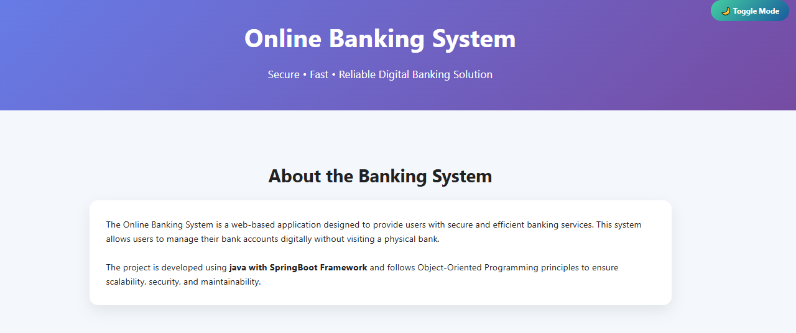
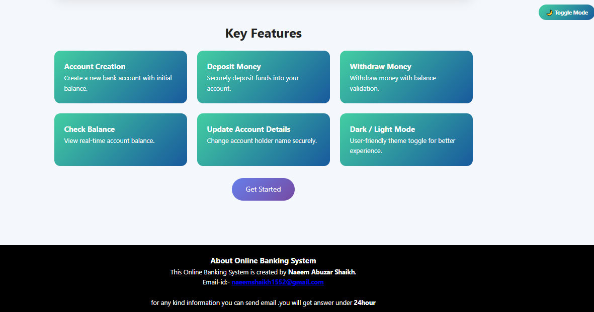
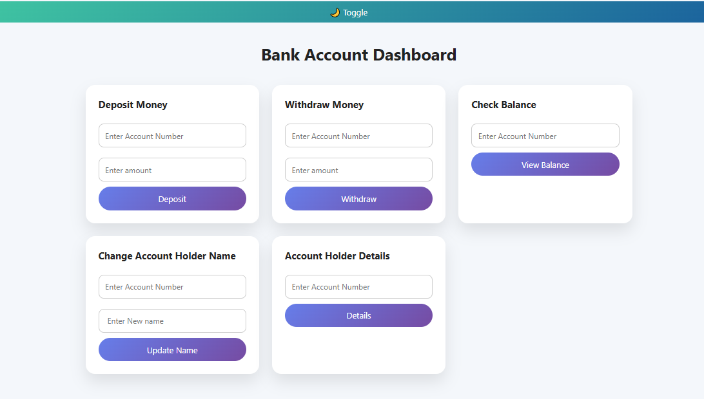
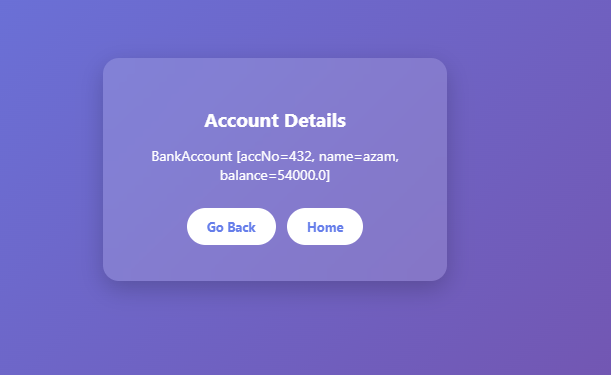
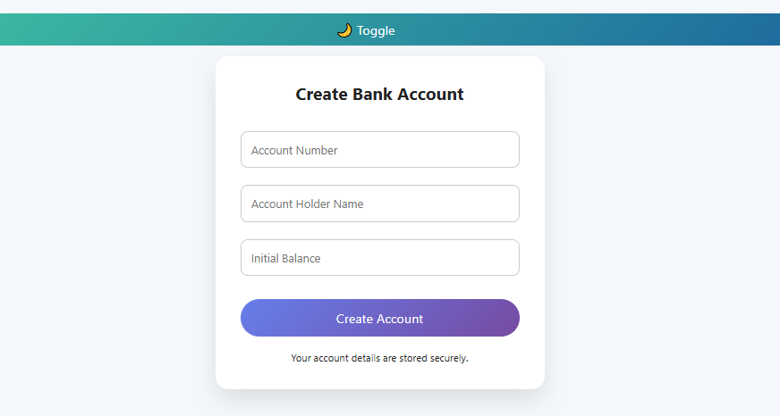

# 🏦 Banking Demo System

> A simple and elegant **Bank Management Web Application** built using **Spring Boot + Thymeleaf**.
> See live demo: our site is live at https://11223naeem.github.io/Seccure_Banking_management_System/ | Feel free to use but credit appreciated and a ⭐ to repo ;)

---

## 🚀 Features

✨ Create New Bank Account
💰 Deposit Money
💸 Withdraw Money
📊 Check Balance
🧾 View Account Details
✏️ Update Account Name
🔐 Simple Login System (Account Number based)

---

## 🛠️ Tech Stack

| Technology         | Usage                    |
| ------------------ | ------------------------ |
| ☕ Java             | Backend Logic            |
| 🌱 Spring Boot     | Framework                |
| 🍃 Spring Data JPA | Database Handling        |
| 🗄️ MySQL          | Database                 |
| 🎨 Thymeleaf       | Frontend Template Engine |
| 💻 HTML + CSS      | UI Design                |

---

## 📸 Screenshots


### 🔐 Home Page




### 🔐 Login Page


### 📊 Dashboard



### 🧾 Account Details



### ➕ Create Account



---

## ⚙️ How to Run Locally

### 1️⃣ Clone Repository

```bash
git clone https://github.com/your-username/Banking_Demo.git
```

### 2️⃣ Open in STS / IntelliJ

Import as **Maven Project**

### 3️⃣ Configure Database

Update in `application.properties`:

```properties
spring.datasource.url=jdbc:mysql://localhost:3306/bankdb
spring.datasource.username=root
spring.datasource.password=yourpassword
spring.jpa.hibernate.ddl-auto=update
```

### 4️⃣ Run Application

Run as:

```
Spring Boot App
```

### 5️⃣ Open Browser

```
http://localhost:8080
```

---

## 📂 Project Structure

```
Banking_Demo/
│── src/
│   ├── controller/
│   ├── model/
│   ├── repository/
│── templates/
│── static/
│── application.properties
│── pom.xml
```

---

## 💡 Future Improvements

🔒 Add Password Authentication
📱 Make Responsive UI
📈 Transaction History
🌐 Deploy Online

---

## 👨‍💻 Author

**Naeem Shaikh**
📌 Passionate Java Developer

---

## ⭐ Support

If you like this project:

👉 Star ⭐ this repo
👉 Share with others

---

## 📜 License

This project is for learning purposes.
